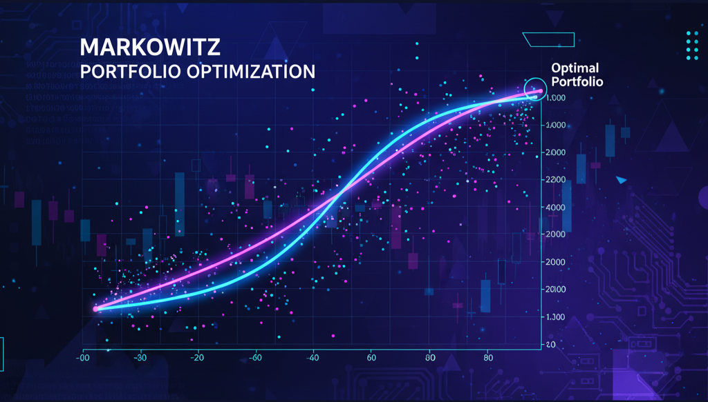

# 🐍 Python for Finance  
### Ứng dụng trong Phân tích & Đầu tư Chứng khoán Việt Nam

> Làm chủ Python, dữ liệu tài chính và chứng khoán với 8 buổi học  
> Khóa học thực chiến, hướng dẫn bởi chuyên gia **Fin68**.

---

<div align="center">
  <a href="#dang-ky-ngay" title="Đăng ký khóa học ngay">
    
  </a>
</div>
---

## 🎯 Mục tiêu khóa học
Khóa học **Python for Finance** được thiết kế dành riêng cho:

- Nhà đầu tư muốn **hiểu và ứng dụng dữ liệu** trong quyết định mua – bán cổ phiếu.  
- Sinh viên, học viên cao học tài chính mong muốn **thành thạo công cụ phân tích hiện đại**.  
- Người làm phân tích đầu tư, tư vấn tài chính hoặc nghiên cứu định lượng muốn **tự động hóa báo cáo và mô hình tài chính**.

Sau khóa học, học viên sẽ có khả năng:

- Xử lý dữ liệu tài chính thực tế bằng **`Pandas`, `NumPy`, `Fin68 SDK`**.  
- Phân tích và trực quan hóa dữ liệu chứng khoán.  
- Xây dựng **mô hình `tối ưu danh mục Markowitz`** và xử lý tự động chuỗi dữ liệu **báo cáo tài chính doanh nghiệp Việt Nam**.

---

<div align="center">
  <a href="#dang-ky-ngay" title="Đăng ký khóa học ngay">
    
  </a>
</div>

---

## 💡 Điểm nổi bật của khóa học
✅ Ứng dụng **dữ liệu chứng khoán Việt Nam thực tế** (HOSE, HNX, UPCoM).  
✅ 100% **thực hành trên Notebook & Visual Studio Code**.  
✅ Hướng dẫn bởi **chuyên gia Python trong ngành tài chính** – nhiều năm kinh nghiệm trong FinTech.  
✅ Cung cấp **bộ dữ liệu, notebook và video trọn đời**.  
✅ Dễ học – kể cả cho người **chưa biết lập trình**.

---

## 🧰 Công cụ & Môi trường học
- **Python 3.10+**, **VSCode**, **Jupyter Notebook**
- Thư viện: `pandas`, `numpy`, `matplotlib`, `scipy`, `fin68`
- Cài đặt nhanh:  
  ```bash
  pip install fin68
````

*(Tự động cấu hình môi trường và truy cập dữ liệu tài chính Việt Nam.)*

---

## 👨‍🏫 Giảng viên

> **Hoàng Mạnh Hùng – Financial Data Analyst tại Fin68 và Trưởng bộ phận phát triển sản phẩm Công ty CP chứng khoán Rồng Việt**
>
> * 4+ năm kinh nghiệm trong lĩnh vực Data Analyst & Quantitative Finance
> * Giảng viên thỉnh giảng các khóa Python for Finance và Quant Research


*Ảnh minh họa: Giảng viên hướng dẫn buổi thực hành về danh mục đầu tư.*

---

## 📅 Hình thức học

| Hình thức                 | Thời lượng     | Ghi chú                                  |
| ------------------------- | -------------- | ---------------------------------------- |
| Online (Zoom)             | 8 buổi × 2 giờ | Có hỗ trợ video ghi hình                 |
| **Tài liệu**              | Trọn đời       | Notebook, dữ liệu và hướng dẫn Fin68 SDK |

---

## 💸 Học phí & Ưu đãi

* **Học phí gốc:** 3.500.000 VND
* **Ưu đãi đăng ký sớm:** -30% (trước ngày khai giảng)
* **Sinh viên & học viên Fin68:** -10%


<div align="center">
  <a href="#dang-ky-ngay" title="Đăng ký khóa học ngay">
    
  </a>
</div>

---

## 🧾 Cách đăng ký

> ✳️ **Bước 1:** Truy cập trang đăng ký

> ✳️ **Bước 2:** Điền thông tin cá nhân

> ✳️ **Bước 3:** Nhận email xác nhận và hướng dẫn học

---

## 📞 Liên hệ hỗ trợ

> 📧 **Email:** [support@fin68.vn](mailto:support@fin68.vn)

> 🌐 **Website:** [https://fin68.vn](https://fin68.vn)

> 📱 **Zalo:** 035 905 2501

> 💬 **Fanpage:** [facebook.com/fin68.vn](https://facebook.com/fin68.vn)

---

<div align="center">

🎓 **Fin68 – Python for Finance**

Từ dữ liệu → Phân tích → Quyết định đầu tư thông minh 💡

</div>
```


