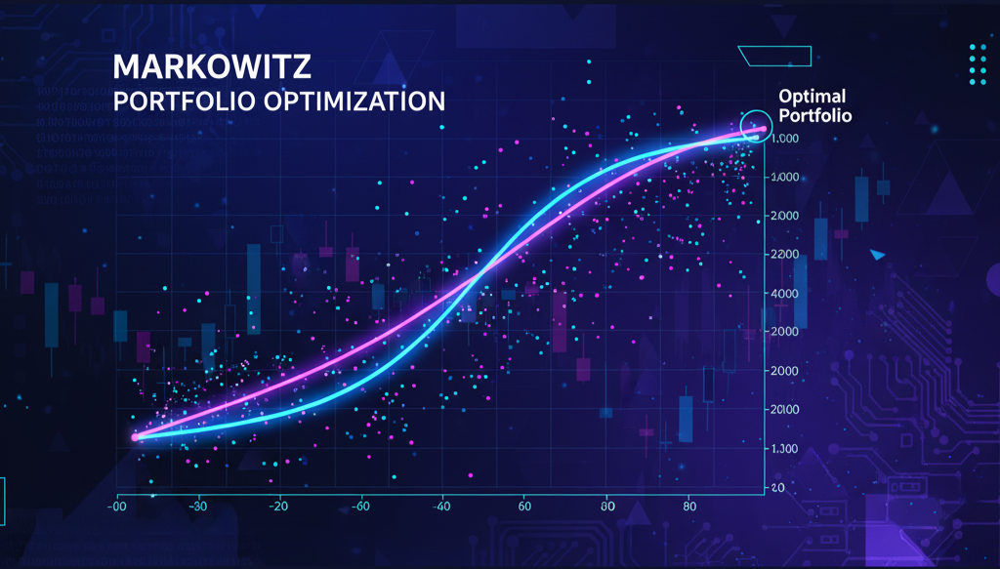

# 🐍 Python for Finance  
### Ứng dụng trong Phân tích & Đầu tư Chứng khoán Việt Nam

> 🗓️ **Khai giảng dự kiến:** **10/11/2025**
>
> 💡 **Làm chủ Python, dữ liệu tài chính và tư duy đầu tư định lượng** chỉ sau **8 buổi học**  
>
> 👨‍🏫 **Khóa học thực chiến**, hướng dẫn bởi chuyên gia **Fin68**

---

<div align="center">
  <a href="https://fin68.vn/register/python-for-finance" title="Đăng ký khóa học ngay">
    
  </a>
</div>

---

## 🎯 Mục tiêu khóa học
Khóa học **Python for Finance** được thiết kế dành riêng cho:

- Nhà đầu tư muốn **hiểu và ứng dụng dữ liệu** trong quyết định mua – bán cổ phiếu.  
- Sinh viên, học viên cao học tài chính mong muốn **thành thạo công cụ phân tích hiện đại**.  
- Người làm phân tích đầu tư, tư vấn tài chính hoặc nghiên cứu định lượng muốn **tự động hóa báo cáo và mô hình tài chính**.

Sau khóa học, học viên sẽ có khả năng:

- Xử lý dữ liệu tài chính thực tế bằng **Pandas, NumPy, Fin68 SDK**.  
- Phân tích và trực quan hóa dữ liệu chứng khoán.  
- Xây dựng **mô hình tối ưu danh mục Markowitz**, **backtest chiến lược giao dịch** và **phân tích báo cáo tài chính doanh nghiệp Việt Nam**.

---

<div align="center">
  <a href="https://fin68.vn/register/python-for-finance" title="Đăng ký khóa học ngay">
    
  </a>
</div>

---

## 💡 Điểm nổi bật của khóa học
✅ Ứng dụng **dữ liệu chứng khoán Việt Nam thực tế** (HOSE, HNX, UPCoM).  
✅ 100% **thực hành trên Notebook & Visual Studio Code**.  
✅ Hướng dẫn bởi **chuyên gia Python trong ngành tài chính** – nhiều năm kinh nghiệm trong FinTech.  
✅ Cung cấp **bộ dữ liệu, notebook và video trọn đời**.  
✅ Dễ học – kể cả cho người **chưa biết lập trình**.

---

## 📘 Lộ trình 8 buổi học

<div align="center">
  <table style="border-collapse: collapse; width: 100%; text-align: center;">
    <thead>
      <tr>
        <th style="border: 1px solid var(--md-default-border-color); padding: 8px;">Buổi</th>
        <th style="border: 1px solid var(--md-default-border-color); padding: 8px;">Chủ đề chính</th>
      </tr>
    </thead>
    <tbody>
      <tr>
        <td style="border: 1px solid var(--md-default-border-color); padding: 8px;">1</td>
        <td style="border: 1px solid var(--md-default-border-color); padding: 8px;">Python cơ bản cho tài chính</td>
      </tr>
      <tr>
        <td style="border: 1px solid var(--md-default-border-color); padding: 8px;">2</td>
        <td style="border: 1px solid var(--md-default-border-color); padding: 8px;">Làm sạch dữ liệu chứng khoán</td>
      </tr>
      <tr>
        <td style="border: 1px solid var(--md-default-border-color); padding: 8px;">3</td>
        <td style="border: 1px solid var(--md-default-border-color); padding: 8px;">Phân tích &amp; trực quan hóa</td>
      </tr>
      <tr>
        <td style="border: 1px solid var(--md-default-border-color); padding: 8px;">4</td>
        <td style="border: 1px solid var(--md-default-border-color); padding: 8px;">Time Series &amp; kỹ thuật</td>
      </tr>
      <tr>
        <td style="border: 1px solid var(--md-default-border-color); padding: 8px;">5</td>
        <td style="border: 1px solid var(--md-default-border-color); padding: 8px;">Lý thuyết Markowitz</td>
      </tr>
      <tr>
        <td style="border: 1px solid var(--md-default-border-color); padding: 8px;">6</td>
        <td style="border: 1px solid var(--md-default-border-color); padding: 8px;">Backtest chiến lược</td>
      </tr>
      <tr>
        <td style="border: 1px solid var(--md-default-border-color); padding: 8px;">7</td>
        <td style="border: 1px solid var(--md-default-border-color); padding: 8px;">Báo cáo tài chính</td>
      </tr>
      <tr>
        <td style="border: 1px solid var(--md-default-border-color); padding: 8px;">8</td>
        <td style="border: 1px solid var(--md-default-border-color); padding: 8px;">Mini-capstone</td>
      </tr>
    </tbody>
  </table>
</div>

---

---

## 🧰 Công cụ & Môi trường học

- **Python 3.12+**, **VSCode**, **Jupyter Notebook**
- Thư viện: `pandas`, `numpy`, `matplotlib`, `scipy`, `fin68`
- Cài đặt nhanh:  

```python

  pip install fin68

```

*(Tự động cấu hình môi trường và truy cập dữ liệu tài chính Việt Nam.)*

---

## 👨‍🏫 Giảng viên

> **Hoàng Mạnh Hùng – Financial Data Analyst tại Fin68 và trưởng bộ phận phát triển sản phẩm tại Công ty Cổ phần chứng khoán Rồng VIệt**

> * Thạc sĩ chuyên ngành Tài chính doanh nghiệp - Đại học Kinh tế TP.Hồ Chí Minh (UEH)

> * 4+ năm kinh nghiệm trong lĩnh vực Data Analyst & Quantitative Finance

> * Giảng viên thỉnh giảng các khóa Python for Finance và Quant Research

---

## 📅 Hình thức học

| Hình thức                 | Thời lượng     | Ghi chú                                  |
| ------------------------- | -------------- | ---------------------------------------- |
| Online (Zoom)             | 8 buổi × 2 giờ | Có hỗ trợ video ghi hình                 |
| **Tài liệu**              | Trọn đời       | Notebook, dữ liệu và hướng dẫn Fin68 SDK |

---

## 💸 Học phí & Ưu đãi

* **Học phí gốc:** 2.500.000 VND
* **Ưu đãi đăng ký sớm:** -30% (trước ngày khai giảng)
* **Sinh viên & học viên Fin68:** -10%

<div align="center">
  <a href="https://fin68.vn/register/python-for-finance" title="Đăng ký khóa học ngay">
    
  </a>
</div>
---

## 🧾 Cách đăng ký

> ✳️ **Bước 1:** Truy cập trang đăng ký 🔗 [https://fin68.vn/register/python-for-finance](https://fin68.vn/register/python-for-finance)

> ✳️ **Bước 2:** Điền thông tin cá nhân

> ✳️ **Bước 3:** Nhận email xác nhận và hướng dẫn học

---

## 📞 Liên hệ hỗ trợ

> 📧 **Email:** [support@fin68.vn](mailto:support@fin68.vn)

> 🌐 **Website:** [https://fin68.vn](https://fin68.vn)

> 📱 **Zalo:** 035.905.2501

> 💬 **Fanpage:** [www.facebook.com/fin68vna](https://www.facebook.com/fin68vna)

---

<div align="center">

🎓 <b>Fin68 – Python for Finance</b>
Từ dữ liệu → Phân tích → Quyết định đầu tư thông minh 💡

</div>
```


